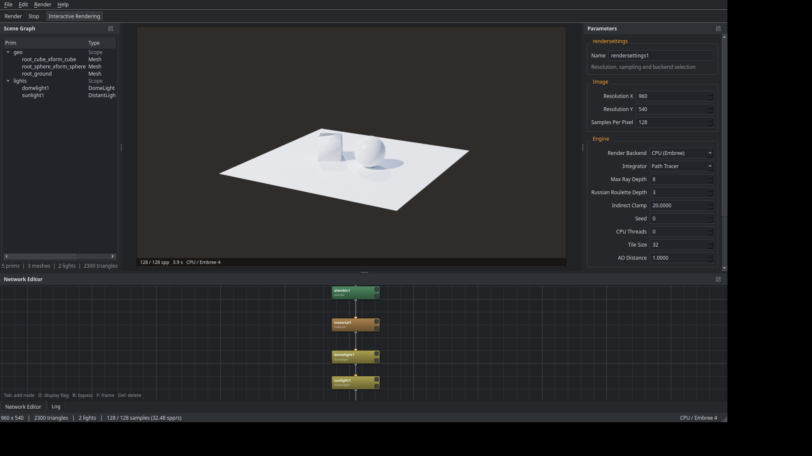
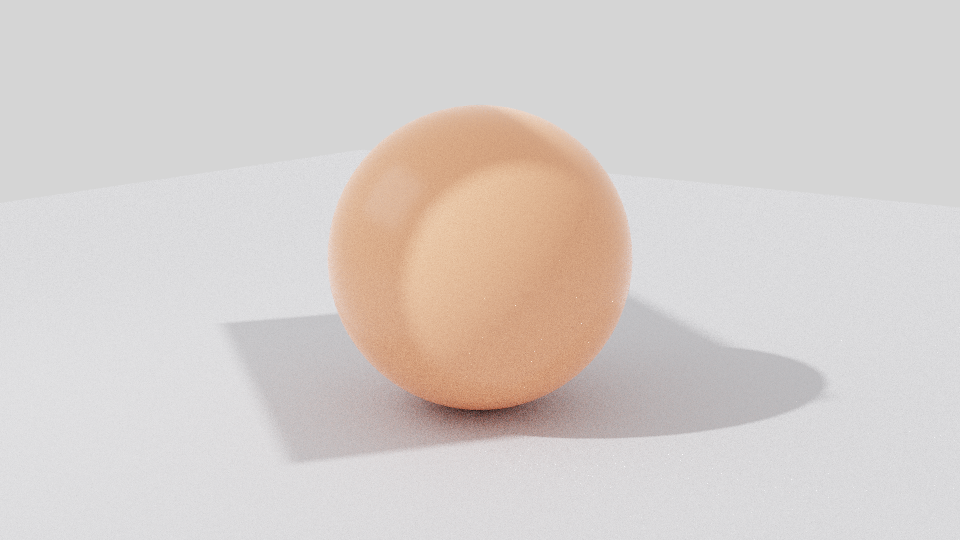
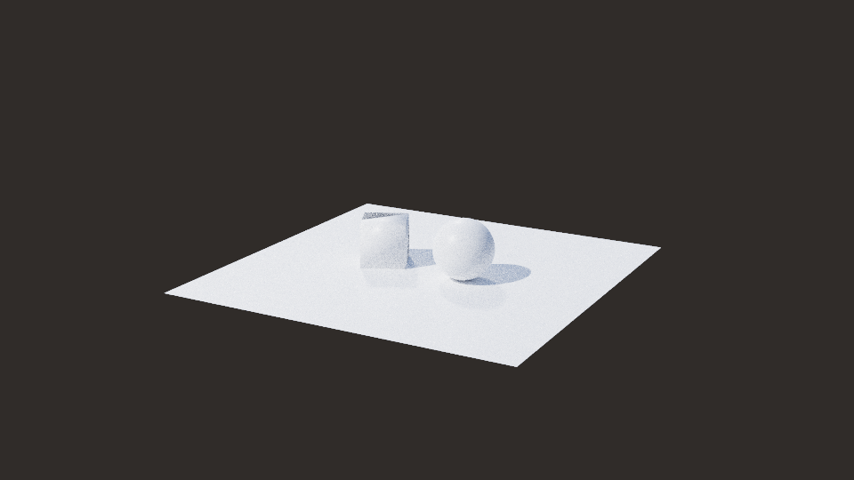
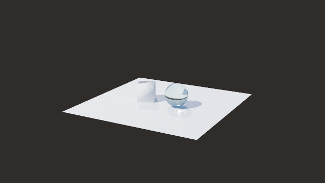

# Solstice

A standalone desktop path tracer with a node based workflow inspired by Houdini Solaris.
Load Alembic caches, place lights and an HDRI environment, and render with either the
Intel Embree CPU backend or the NVIDIA OptiX GPU backend — both driven by the same
light transport code.



## What it does

* **Alembic import** — polygon meshes and subdivision cages from `.abc` archives, including
  the transform hierarchy, UVs and normals, sampled at any time on the archive timeline.
* **Lighting** — dome (HDRI), distant/sun, rect, disk and sphere area lights with
  physically meaningful intensity, exposure and shape controls.
* **HDRI environments** — Radiance `.hdr`, OpenEXR `.exr` and LDR images, importance sampled
  through a 2D CDF so sun-in-the-sky maps converge quickly.
* **Path tracing** — progressive unidirectional path tracer with next event estimation,
  multiple importance sampling, a principled BSDF (diffuse, GGX metal/dielectric specular,
  rough dielectric transmission, emission), Russian roulette and firefly clamping.
* **Two backends** — `CPU (Embree)` uses Embree 4 with a tiled thread pool; `GPU (OptiX)` uses
  OptiX with per-mesh GAS and a top level IAS. The integrator, BSDF and light sampling code
  is a single set of headers compiled for both.
* **Node network** — a Solaris-like network where every node edits the stage flowing through
  it: geometry sources, transforms, material assignment by prim pattern, lights, camera and
  render settings. Display flags, bypass flags, a Tab menu and a scene graph tree included.
* **Interactive rendering** — edits re-cook the network and restart the render automatically;
  the viewport orbits with Houdini style Alt + mouse navigation.
* **Batch rendering** — the same executable renders from the command line without a display.

| Default scene | Alembic + HDRI | Rough dielectric glass |
| --- | --- | --- |
|  |  |  |

## Building

### Dependencies

| Dependency | Required | Notes |
| --- | --- | --- |
| Qt 6 (Core, Gui, Widgets) | yes | 6.2 or newer |
| Embree 4 | yes | CPU path tracing backend |
| Alembic 1.8 | optional | `.abc` import, `-DSOLSTICE_ENABLE_ALEMBIC=OFF` to skip |
| OpenEXR 3 | optional | `.exr` reading and writing |
| CUDA + OptiX SDK 7.7–9.x | optional | `-DSOLSTICE_ENABLE_OPTIX=ON` |

### Linux

```bash
sudo apt install build-essential cmake ninja-build qt6-base-dev libembree-dev \
                 libopenexr-dev libimath-dev

# Alembic is not packaged on every distribution:
git clone --depth 1 --branch 1.8.6 https://github.com/alembic/alembic.git
cmake -S alembic -B alembic/build -DCMAKE_BUILD_TYPE=Release -DUSE_HDF5=OFF \
      -DALEMBIC_SHARED_LIBS=ON -DUSE_TESTS=OFF
cmake --build alembic/build -j && sudo cmake --install alembic/build

cmake -S . -B build -G Ninja -DCMAKE_BUILD_TYPE=Release
cmake --build build -j
./build/bin/Solstice
```

### Windows (self contained `Solstice.exe`)

Install [Qt 6](https://www.qt.io/download-qt-installer) and use
[vcpkg](https://vcpkg.io) for the rest:

```powershell
vcpkg install embree:x64-windows alembic:x64-windows openexr:x64-windows
cmake -S . -B build -G "Visual Studio 17 2022" -A x64 ^
      -DCMAKE_TOOLCHAIN_FILE=C:/vcpkg/scripts/buildsystems/vcpkg.cmake ^
      -DCMAKE_PREFIX_PATH=C:/Qt/6.7.2/msvc2019_64
cmake --build build --config Release
cmake --build build --target deploy      # runs windeployqt next to Solstice.exe
```

`build/bin/Release/Solstice.exe` plus the deployed Qt runtime is a self contained folder that
can be zipped and moved to another machine. See [docs/building_windows.md](docs/building_windows.md)
for the details, including how to point the build at the OptiX SDK.

### Enabling the OptiX backend

```bash
cmake -S . -B build -DSOLSTICE_ENABLE_OPTIX=ON -DOptiX_ROOT=/path/to/OptiX-SDK-9.0.0
```

The device programs are compiled to PTX by `nvcc` and embedded into the executable, so no
extra files have to ship next to it. When the build has no OptiX support, or no CUDA device
is present at runtime, the renderer logs a warning and falls back to Embree.

## Using it

### Interface

| Panel | Purpose |
| --- | --- |
| Scene Network | the node graph; the node with the blue display flag is what gets rendered |
| Render View | progressive result, Alt+LMB orbit, MMB pan, wheel dolly |
| Parameters | parameters of the selected node |
| Scene Graph | prims produced by the cooked network |
| Log | loader, cook and renderer messages |

Shortcuts: `Tab` add node, `D` display flag, `B` bypass, `F` frame network, `Del` delete,
`F5` render, `Esc` stop, `Ctrl+E` save image.

### A typical Alembic + HDRI setup

1. `Tab` → **Alembic Import**, pick the `.abc` file.
2. `Tab` → **Material**, set *Assign To* to `*` or a prim pattern such as `/geo/body*`.
3. `Tab` → **Dome Light**, pick an `.hdr` or `.exr` environment.
4. `Tab` → **Distant Light** for a sun, or **Rect Light** for a studio key light.
5. `Tab` → **Camera**, then *Render → Copy View To Camera Node* after framing the shot.
6. `Tab` → **Render Settings** for resolution, samples and the backend, and set its display flag.

Each node consumes the stage from its input and adds to it, so the network reads top to
bottom exactly like a Solaris LOP chain.

### Command line

```bash
# Render an existing network
Solstice --headless scene.solstice -o beauty.exr -s 512

# Build a network from an Alembic cache and an HDRI, then render it
Solstice --headless -a cache.abc -e studio.hdr -o render.png -s 256 --width 1920 --height 1080

# Write that generated network to disk instead of rendering it
Solstice --headless -a cache.abc -e studio.hdr --no-render --save-scene shot.solstice

# Force a backend
Solstice --headless scene.solstice -b gpu -o gpu.png
```

`--help` lists every option. Output format follows the file extension: `.png` is tone mapped
with the film settings of the scene, `.exr` and `.hdr` keep linear scene referred values.

## Examples

`examples/` contains two ready made networks. They reference generated assets, so create
those first:

```bash
./build/bin/sol_make_test_abc examples/kit.abc      # writes a small Alembic archive
python3 tools/make_test_hdri.py examples/sky.hdr    # writes a synthetic HDRI sky
./build/bin/Solstice examples/alembic_hdri.solstice
```

| Scene | Shows |
| --- | --- |
| `studio_sphere.solstice` | the default studio setup: ground, sphere, dome, sun and a rect key light |
| `alembic_hdri.solstice` | an Alembic import lit by an HDRI dome and a sun |
| `glass_sphere.solstice` | the same import with a smooth dielectric assigned to the sphere |

## Tests

```bash
cmake --build build --target solstice_tests && ./build/bin/solstice_tests
```

The suite covers matrix and sampling maths, environment map orientation and pdf consistency,
BSDF energy and sample/eval agreement, glob matching, node graph cooking plus serialisation,
and two end to end renders that verify instance transforms and overall image sanity.

## Documentation

* [docs/architecture.md](docs/architecture.md) — how cooking, the scene and the backends fit together
* [docs/nodes.md](docs/nodes.md) — reference for every node type and its parameters
* [docs/building_windows.md](docs/building_windows.md) — producing a distributable `.exe`
* [docs/README.ru.md](docs/README.ru.md) — описание на русском

## Limitations

* Subdivision surfaces are rendered as their polygon cage; no Catmull-Clark refinement yet.
* Alembic curves, points and NuPatch prims are skipped.
* No texture maps on materials yet — colours are constant per material node.
* The OptiX backend is compiled and validated in CI, but it needs an NVIDIA GPU at runtime;
  without one the application transparently uses Embree.
